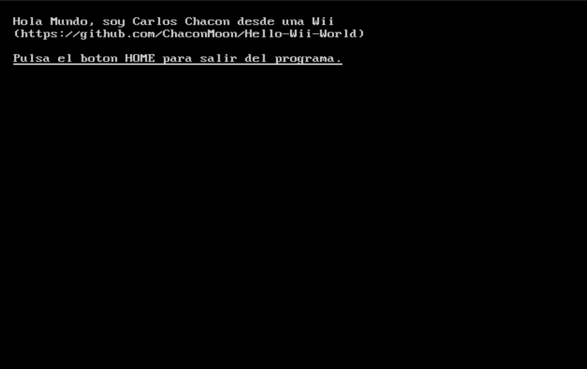

# Hello Wii World

Un pequeño **Hello World para Wii**, creado para aprender los fundamentos del
desarrollo homebrew con C, devkitPPC, libogc y el control de un **Wii Remote**.

<p align="center">
	
</p>

## ¿Qué incluye?

- Inicialización del sistema de vídeo de la consola.
- Texto en pantalla mediante la consola de libogc.
- Un bucle principal sincronizado con el refresco vertical.
- Lectura de mandos y botones del Wii Remote.
- Generación de un paquete ejecutable mediante Homebrew Channel.

## Requisitos

La forma recomendada de compilar el proyecto es utilizar el contenedor de
desarrollo incluido. Para ello necesitas:

- [Visual Studio Code](https://code.visualstudio.com/).
- [Docker](https://www.docker.com/).
- La extensión [Dev Containers](https://marketplace.visualstudio.com/items?itemName=ms-vscode-remote.remote-containers)
	para Visual Studio Code.

También puedes instalar manualmente devkitPPC y las bibliotecas necesarias
desde los repositorios oficiales de [devkitPro](https://devkitpro.org/).

## Primeros pasos

### 1. Clonar el repositorio

```bash
git clone https://github.com/ChaconMoon/Hello-Wii-World.git
cd Hello-Wii-World
```

### 2. Abrir el contenedor de desarrollo

Instala la extensión de Dev Containers si todavía no la tienes:

```bash
code --install-extension ms-vscode-remote.remote-containers
```

Abre el proyecto en Visual Studio Code y ejecuta el comando
`Dev Containers: Reopen in Container` desde la paleta de comandos
(`Ctrl+Shift+P`). Visual Studio Code utilizará la configuración de
`.devcontainer/devcontainer.json` y preparará el entorno de compilación.

### 3. Compilar

Desde la terminal del contenedor, ejecuta:

```bash
make
```

Este comando genera los archivos `HelloWiiChaconMoon.dol` y
`HelloWiiChaconMoon.elf` en la raíz del proyecto. El archivo `.dol` puede
ejecutarse en una Wii o en un emulador compatible.

Para crear el paquete de distribución, ejecuta:

```bash
make package
```

El comando crea la carpeta `dist/HelloWiiChaconMoon/`, con el ejecutable
renombrado a `boot.dol`, `meta.xml` e `icon.png`. También genera el archivo
`dist/HelloWiiChaconMoon.zip`.

Para instalarlo en una Wii con Homebrew Channel, copia la carpeta
`HelloWiiChaconMoon` dentro de `apps/` en la tarjeta SD o dispositivo USB.

Para ejecutar el programa mediante `wiiload`, usa:

```bash
make run
```

Para eliminar los archivos generados:

```bash
make clean
```

## Cómo funciona

1. `VIDEO_Init()` inicializa el sistema de vídeo de la Wii.
2. `WPAD_Init()` inicializa el sistema de mandos Wii Remote.
3. `VIDEO_GetPreferredMode(NULL)` obtiene el modo de vídeo preferido y
	 `VIDEO_Configure()` lo aplica.
4. `console_init()` configura la salida de texto en pantalla.
5. `WPAD_ScanPads()` comprueba el estado de los mandos en cada iteración.
6. `WPAD_ButtonsDown(0)` obtiene los botones pulsados en el primer mando.
7. Al pulsar el botón HOME, el programa apaga la salida de vídeo y termina.

## Estructura del proyecto

```text
.
├── .devcontainer/       # Configuración del contenedor de desarrollo.
├── .vscode/             # Configuración de Visual Studio Code.
├── icon.png             # Icono del paquete, de 128 x 48 píxeles.
├── Makefile             # Reglas de compilación y empaquetado.
├── meta.xml             # Metadatos del paquete.
└── source/              # Código fuente de la aplicación.
	└── template.c
```